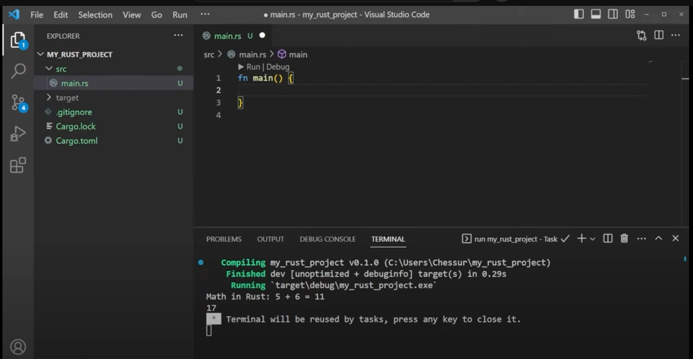

# Rusty

## Why?

🚀 This is going to be my learning process for Rust

🧨🧨 I will have Rust installed on various OS's and downloaded to play with. 

## What? 

Not sure yet. I'll see where this takes me and I'm looking to learn from TCM Security and other places +
to Sharpen my skill set. 

1. I installed Rust from Here: https://www.rust-lang.org/tools/install

2. Created this Repo for storing code and making changes

3. I started watching the YouTube video 

* Here is where I left off: 
